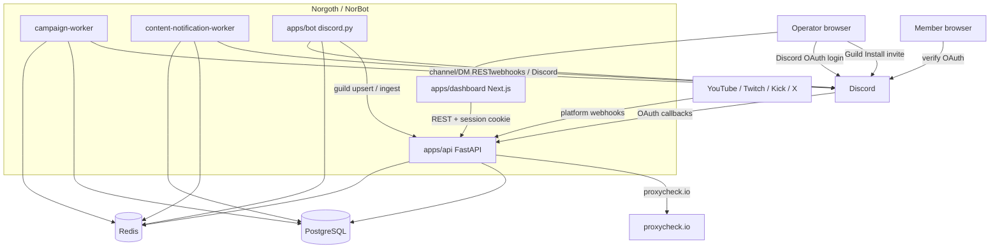

# arc42 Architecture Documentation

**Product (code):** Norgoth — Discord Community Command Center  
**Deploy / brand:** NorBot (`norbot.io`)  
**GitHub:** `Vearonn55/norgoth-discord-bot`  
**Version:** living document (codebase as of 2026-08-12)  
**Status:** Production-oriented rewrite. Use this file as ChatGPT / assistant context.

---

## 0. ChatGPT / assistant training brief

Paste this whole document as system or project context. Follow these rules when helping Kaan (software engineer) on this repo.

### 0.1 Identity and repo layout

- Workspace root is often `…/VS Code Projects/NorBot`.
- Product monorepo lives under `Norgoth/` (apps, deploy, scripts, product docs).
- This arc42 lives at `NorBot/docs/arc42.md` (repo-level, not under `Norgoth/docs/`).
- Do not confuse **code name Norgoth** with **deploy brand NorBot**. Compose project is `norbot`; production containers are `norbot-prod-*`.

### 0.2 How to work

- Prefer coding in the existing files. Do not invent a second bot, API, or dashboard.
- Do not commit or push unless the user asks. (If they explicitly say commit/push, do it.)
- Do not recreate or edit Cursor plan files unless asked.
- Production-first: making `main` / live `norbot.io` work beats polishing staging unless asked.
- Secrets stay in env files. Never commit `/opt/norbot/env/*.env` or `Norgoth/.env`.

### 0.3 Hard production truths (2026-08)

1. **SSH to the VDS is not port 22.** Use `secrets.DEPLOY_PORT` (historically **35342**). `deploy-production.yml`, `deploy-test.yml`, and `rehydrate-test-db.yml` must pass `port: ${{ secrets.DEPLOY_PORT }}`. Defaulting to 22 times out (`dial tcp …:22: i/o timeout`). Prefer an IPv4 `DEPLOY_HOST`; workflows resolve A records only so GitHub-hosted runners do not stall on AAAA.
2. **Manual compose on the VDS needs image env vars.** Actions export them; a bare `docker compose -f deploy/compose.yml -f deploy/compose.production.yml` fails with `NORBOT_*_IMAGE is missing`. Export:
   - `NORBOT_IMAGE_TAG` = SHA from `/opt/norbot/releases/CURRENT`
   - `NORBOT_API_IMAGE=ghcr.io/vearonn55/norbot-api`
   - `NORBOT_BOT_IMAGE=ghcr.io/vearonn55/norbot-bot`
   - `NORBOT_WEB_IMAGE=ghcr.io/vearonn55/norbot-web`
   Or use `docker logs norbot-prod-bot-1` without compose.
3. **`GET /bot/health` HTTP 200 does not mean Discord-online.** Body can be `connected: false`. Repo `smoke-check.sh` now requires `connected: true` via JSON; **the VDS copy under `/opt/norbot/scripts/` may lag the git repo** until it is synced. Actions call the VDS copies, not the freshly pushed scripts, unless something copies them.
4. **Docker image paths are shallow.** Bot code is `/app/bot/config.py` (not the monorepo depth). Never use unconditional `Path(__file__).parents[3]` / `parents[4]` for dotenv. Guard with `len(path.parents) > N` then `load_dotenv()`.
5. **Guild Install ≠ login OAuth.** Bot invite is `https://discord.com/oauth2/authorize` with `scope=bot applications.commands` and `integration_type=0`. **No `redirect_uri` / `response_type`.** Developer Portal **Bot → Requires OAuth2 Code Grant must stay OFF**. Login OAuth (`identify` + `guilds`) is a separate flow with two redirect URIs.
6. **`DISCORD_BOT_TOKEN` must belong to the same application as `DISCORD_APPLICATION_ID` / `NORGOTH_DISCORD_CLIENT_ID`.** Invite uses the application ID; presence uses the token.
7. **Compose overlay is required in production:** `-f deploy/compose.yml -f deploy/compose.production.yml` plus `--env-file /opt/norbot/env/production.env`.
8. **Workers share the API image.** `campaign-worker` and `content-worker` run `python -m app.workers.*` in `norbot-api`. If they crash-loop, Discord can still look “API healthy” because `api` and `web` are up.

### 0.4 Typical file map for changes

| Change | Where |
|---|---|
| Discord Gateway behavior | `Norgoth/apps/bot/bot/*.py` |
| HTTP API / workers / Alembic | `Norgoth/apps/api/` |
| Dashboard UI | `Norgoth/apps/dashboard/src/` |
| Compose / Dockerfiles / nginx | `Norgoth/deploy/` |
| CI / deploy Actions | `.github/workflows/` |
| VDS scripts (source) | `Norgoth/scripts/docker/` and `Norgoth/scripts/vds/` |
| Product runbooks | `Norgoth/docs/` |

---

## Table of Contents

1. [Introduction and Goals](#1-introduction-and-goals)
2. [Architecture Constraints](#2-architecture-constraints)
3. [System Context and External Interfaces](#3-system-context-and-external-interfaces)
4. [Solution Strategy](#4-solution-strategy)
5. [Building Block View](#5-building-block-view)
6. [Runtime View](#6-runtime-view)
7. [Deployment View](#7-deployment-view)
8. [Cross-cutting Concepts](#8-cross-cutting-concepts)
9. [Architecture Decisions](#9-architecture-decisions)
10. [Quality Requirements](#10-quality-requirements)
11. [Risks and Technical Debt](#11-risks-and-technical-debt)
12. [Glossary](#12-glossary)

---

## 1. Introduction and Goals

### 1.1 Product overview

**Norgoth** is a single unified Discord community management stack under `Norgoth/`:

- Live **discord.py** Gateway bot (`apps/bot`)
- **FastAPI** API (verification, feature config, campaigns, content notifications, ingest) (`apps/api`)
- **Campaign worker** + **content-notification worker** (same API image)
- **Next.js** operator Command Center (`apps/dashboard`)

GitHub/deploy project is branded **NorBot** (Compose project `norbot`, hosts `www.norbot.io` / `api.norbot.io` / `test.norbot.io`). Former sibling `NorgothAuth/` was merged into `Norgoth/apps/api` as the verification domain.

### 1.2 Functional requirements (implemented)

| ID | Requirement | Vertical |
|---|---|---|
| FR-1 | Discord bot connects via Gateway; publishes liveness, guild resources, member snapshots | Bot foundation |
| FR-2 | Welcome / leave messages + auto-role on join, configured in dashboard | Onboarding |
| FR-3 | Member verification: OAuth, policy engine, role grant, HTML result page, manual review | Verification |
| FR-4 | Operator dashboard auth via Discord OAuth + guild manage permission | Operator auth |
| FR-5 | Moderation slash commands with audit log + Discord log channel | Moderation |
| FR-6 | Auto-moderation (words, spam, invites, mass mentions) | AutoMod |
| FR-7 | Server event logging (member/message/role/channel) with Postgres logging config | Logging |
| FR-8 | Tickets: panel, private channels, transcripts, share tokens | Community |
| FR-9 | Leveling: text/voice XP, ranks, role rewards, leaderboard | Community |
| FR-10 | Auto-responses, role menus, invite tracking | Automation |
| FR-11 | Raid protection + honeypot trap channels | Security |
| FR-12 | Top Trending feed channels (vote ranking windows: daily/weekly/monthly/all_time) | Community |
| FR-13 | Campaigns: channel posts + filtered member DMs via queue + worker | Campaigns |
| FR-14 | Content notifications: multi-platform creator alerts (webhooks + worker) | Notifications |
| FR-15 | Managed embed messages (publish, sync, deletion detection) | Messages |
| FR-16 | Dashboard shows live data only (bot/worker health, queue, configs, logs) | Dashboard |
| FR-17 | Guild Install invite from dashboard (`/api/v1/oauth/discord/bot-invite`) | Bot install |

### 1.3 Quality goals

| Priority | Goal | Motivation |
|---|---|---|
| 1 | Truthful UI | Panels backed by live API; empty states with next action when offline |
| 2 | Durability | Postgres is source of truth for campaigns, tickets, feature configs, XP, etc.; Redis is cache/queue/hot path |
| 3 | Privacy | Member IPs stored only as HMAC-SHA256 hash + AES-256-GCM ciphertext |
| 4 | Operability | Single product env, Compose + GHCR deploys, health/smoke/rollback runbooks |
| 5 | Testability | API/bot pytest + dashboard Vitest/lint/build in CI; tests must not assume local `development` env |

---

## 2. Architecture Constraints

| Constraint | Description |
|---|---|
| Python API + bot | FastAPI / discord.py; **Docker & CI use Python 3.12** |
| TypeScript dashboard | Next.js 16 / React 19; Node 22 in CI |
| PostgreSQL 16 | Durable SoT (verification + feature/runtime tables) |
| Redis 7 (AOF) | Queues, heartbeats, hot configs, resource caches, short-lived tokens/sessions |
| discord.py 2.x | Privileged intents: **Server Members** + **Message Content** |
| Secrets via env | `Norgoth/.env` locally; `/opt/norbot/env/*.env` on VDS — never committed |
| Public ingress | Host nginx TLS only; app ports bound to loopback in prod/test overlays |
| Image tags | GHCR images tagged by **full git SHA**; compose interpolates `NORBOT_*_IMAGE` + `NORBOT_IMAGE_TAG` |

---

## 3. System Context and External Interfaces



| System | Protocol | Purpose |
|---|---|---|
| Discord Gateway | WebSocket | Presence, joins, slash commands, message events |
| Discord REST v10 | HTTPS | Roles, messages, channels, embeds, campaign DMs |
| Discord OAuth2 (login) | HTTPS | Member verification + operator dashboard login (`identify`, `guilds`) |
| Discord Guild Install | HTTPS authorize | Add bot to a guild (`bot` + `applications.commands`, `integration_type=0`) |
| proxycheck.io | HTTPS | Optional VPN/proxy detection (fail-closed when policy on) |
| Content platforms | HTTPS webhooks / APIs | YouTube WebSub, Twitch EventSub, Kick, X |

### 3.1 Discord Developer Portal (must stay aligned)

| Setting | Expected |
|---|---|
| Application ID | Same value as `DISCORD_APPLICATION_ID` and typically `NORGOTH_DISCORD_CLIENT_ID` |
| Bot token | `DISCORD_BOT_TOKEN` (same app) |
| Privileged intents | Server Members, Message Content |
| Requires OAuth2 Code Grant | **OFF** (Guild Install would fail with “Integration requires code grant”) |
| Redirect URI (member verify) | `https://api.norbot.io/api/v1/oauth/discord/callback` |
| Redirect URI (dashboard login) | `https://api.norbot.io/api/v1/oauth/discord/dashboard/callback` |
| Guild Install scopes | `bot`, `applications.commands` |

Invite builder: `build_bot_invite_url()` in `apps/api/app/security/discord_permissions.py`.

---

## 4. Solution Strategy

- **One API process** hosts product routes + `/api/v1` verification/session domain.
- **Postgres is the durable source of truth** for verification, feature configs, campaigns, tickets, XP, raid/honeypot, content notifications, embeds, logging config. Redis remains queue, cache, heartbeats, and hot open-ticket paths.
- **The bot is the source of Discord truth** for channels/roles/members and live events. It publishes snapshots/heartbeats to Redis and ingests durable events via `/internal/ingest/...` with header `X-Norgoth-Bot-Token` = `DISCORD_BOT_TOKEN`.
- **The bot is DB-free.** It does not talk to Postgres.
- **Two workers** share the API image: campaign delivery and content-notification processing.
- **Dashboard** is an authenticated Command Center (`NORGOTH_AUTH_ENFORCED=true` in staging/prod); local may allow anonymous dev session (`user_id == "0"`).
- **Module flags** (`/guilds/{id}/modules`, Redis `norgoth:guild:{id}:modules`) gate each vertical. Defaults **enabled**. Each module typically has a bot cog, API routes, and a dashboard page.

---

## 5. Building Block View

```
NorBot/
├── .github/workflows/          # ci, deploy-test, deploy-production, rehydrate-test-db
├── docs/arc42.md               # this document
└── Norgoth/                    # product monorepo root
    ├── .env.example
    ├── scripts/                # dev.sh, docker/*, vds/*
    ├── deploy/                 # compose, Dockerfiles, nginx, env examples
    ├── docs/                   # durability, runbooks, checklists
    └── apps/
        ├── api/                # FastAPI + Alembic + workers
        ├── bot/                # discord.py Gateway bot
        └── dashboard/          # Next.js Command Center
```

### 5.1 `apps/api`

Entry: `app/main.py` → `create_application()`. Health: `GET /api/v1/health` returns `status`, `service`, `version`, `environment` (from `NORGOTH_ENVIRONMENT`).

#### `/api/v1` (verification + operator auth)

| Router | Role |
|---|---|
| `health` | Liveness metadata |
| `guilds` | Guild upsert / listing |
| `configuration` | Member-verification settings |
| `user_lists` | Allow/deny lists |
| `high_risk_guilds` | High-risk server matching |
| `verification_logs` | Attempt history |
| `oauth` | Member verification OAuth |
| `dashboard_oauth` | Operator login OAuth + `/bot-invite` |
| `sessions` | Session exchange / current user |

#### Product routes (selected)

Mounted from `app/routes/*` (no `/api/v1` prefix unless the router adds one):

| Area | File |
|---|---|
| Campaigns + worker health + internal unsubscribe | `campaigns.py` |
| Bot heartbeat/status + Discord resources/members | `bot.py` |
| Module master switches | `modules.py` |
| Welcome/autorole automation | `automation.py` |
| Auto-mod | `automod.py` |
| Moderation logs | `moderation.py` |
| Tickets (auth + public transcript + session) | `tickets.py` |
| Leveling | `leveling.py` |
| Feed channels / ranking | `feed_channels.py` |
| Autoresponder, role menus, invites | `autoresponder.py`, `role_menus.py`, `invites.py` |
| Raid / honeypot | `raid.py`, `honeypot.py` |
| Content notifications + catalog + platform webhooks | `content_notifications.py`, `platform_webhooks.py` |
| Embed messages | `embed_messages.py` |
| Logging config, server logs, system audit | `logging_config.py`, `server_logs.py`, `system_audit_logs.py` |
| Uploads | `uploads.py` |
| Analytics, activity | `analytics.py`, `activity.py` |
| Verification panel | `verification_panel.py` |
| Internal config for bot | `internal_config.py` |
| Internal ingest (bot → Postgres) | `ingest.py` |
| Legacy notifications | `notifications.py` (coexists; delivery owned by content worker) |

Workers:

- `app/workers/campaign_worker.py`
- `app/workers/content_notification_worker.py`

Alembic lives under `app/db/migrations/` (head around `0022_media_provider` as of 2026-08-11 CI).

### 5.2 `apps/bot`

`WORKDIR /app`, `CMD ["python", "main.py"]`. Config: `bot/config.py` (`DISCORD_BOT_TOKEN`, optional `DISCORD_APPLICATION_ID`, `NORGOTH_REDIS_URL`, `NORGOTH_API_URL`).

| Cog / module | Responsibility |
|---|---|
| `client.py` | Gateway client; guild sync; welcome/leave/autorole; heartbeat loop 15s |
| `moderation.py` | `/kick` `/ban` `/timeout` `/purge` (+ userinfo) |
| `automod.py` | Words, spam, invites, mass mentions |
| `server_logging.py` | Discord event logging |
| `tickets.py` | Ticket panel, channels, transcripts |
| `leveling.py` | XP, `/rank`, `/leaderboard`, rewards |
| `autoresponder.py` | Keyword replies |
| `roles.py` | Role menus + `/role` |
| `invites.py` | Invite attribution + `/invites` |
| `raid.py` | Join-rate / young-account protection |
| `honeypot.py` | Trap-channel enforcement |
| `feed_channels.py` | Top Trending vote feeds |
| `campaigns.py` | DM unsubscribe UX |
| `embed_sync.py` | Detect deleted published embeds |
| `analytics.py` | Daily engagement collectors |
| `notifications.py` | Retired bridge — delivery owned by API content worker |
| `state.py` | Redis publisher (`norgoth:bot:heartbeat` TTL 45s, `norgoth:bot:status`, resources, members, modules) |

Heartbeat loop waits until `ready`, then publishes heartbeat + `connected: true` status. API `/bot/health` is `connected` only if **both** heartbeat key exists **and** status JSON has `connected: true`.

Master module keys: `welcome`, `autorole`, `moderation`, `automod`, `logging`, `tickets`, `leveling`, `autoresponder`, `roles`, `invites`, `notifications`, `raid`, `honeypot`, `feed_channels`, `campaigns`.

### 5.3 `apps/dashboard`

Next.js App Router under `src/app/[lang]/` (`en` / `tr`).

Public: landing, login, OAuth complete.  
Authenticated shell: dashboard, campaigns, automation, security, community (tickets, leveling, leaderboard, invites, feed channels, onboarding, manual verification), messages (embeds, content notifications), audit, settings (guild config, bot runtime, language), observability, analytics, servers.

Zustand stores; CoreUI + Tailwind; TinyMCE for rich text.

Invite UX: not-installed servers use a real `<a href>` to `/api/v1/oauth/discord/bot-invite?guild_id=…` (avoid `window.location.href` assignment that ESLint forbids). Simple Guild Install has **no redirect back** to Command Center after Discord Authorize.

### 5.4 Data responsibilities

| Store | Holds |
|---|---|
| **PostgreSQL** | Guilds/verification, feature configs, campaigns + activity + unsubscribes, tickets/transcripts, member XP (text_xp + voice_xp), invite counters, mod/server event logs, raid/honeypot, analytics daily, content-notification graph, embed messages + media assets, logging configurations, feed messages |
| **Redis** | Bot/worker heartbeats & status, guild resources/members, module flags, hot automation/automod/ticket state, campaign queue + schedule zset + activity cache, short-lived sessions/share tokens, spam counters, feed ranking zsets |

Campaign dual-write: Postgres SoT + Redis cache/queue; emergency Redis-only via `NORGOTH_CAMPAIGN_PG_ENABLED=false`.

Internal ingest (bot token):  
`/internal/ingest/{guild_id}/` + `raid-incident`, `honeypot-trigger`, `moderation-log`, `server-event`, `invite-event`, `xp`, `analytics-daily`, `ticket`, `feed-message`, `feed-vote`, `feed-message-edited`, `feed-message-deleted`, `feed-process-dirty`, `feed-repair`, `feed-reconcile`.

---

## 6. Runtime View

### 6.1 Operator login

1. Dashboard login → `GET /api/v1/oauth/discord/dashboard/authorize`.
2. Discord callback → API creates session; redirect to `{dashboard}/{lang}/auth/complete?code=…`.
3. Dashboard exchanges code via `/api/v1/sessions/exchange`.
4. Subsequent API calls use session cookie; guild access gated by Discord **Manage Guild** or **Administrator** (or owner).
5. When `NORGOTH_AUTH_ENFORCED=false` (local), anonymous dev session may be allowed.

OAuth post-login redirects must use **public dashboard origin** (`NORGOTH_DASHBOARD_URL` / `NEXT_PUBLIC_DASHBOARD_URL`), not the internal Docker hostname.

### 6.2 Bot invite (Guild Install)

1. Operator opens Servers page → invite for a guild they manage.
2. `GET /api/v1/oauth/discord/bot-invite?guild_id={id}` (authz: must manage that guild).
3. 307 to Discord authorize URL (`integration_type=0`, scopes `bot applications.commands`, optional `guild_id` + `disable_guild_select=true`).
4. No `redirect_uri` — user stays on Discord after Authorize.
5. Running bot receives `on_guild_join`, syncs resources, registers guild with API `PUT /api/v1/guilds/{id}`.

### 6.3 Member verification

1. Member opens `/api/v1/oauth/discord/authorize/{guild_id}`.
2. API signs OAuth state → Discord → callback with code.
3. Decision engine: whitelist → blacklist → high-risk guilds → VPN/proxy → shared IP → account age. High-risk can enter **manual review**.
4. Allow: bot-token REST grants base member role (removes unverified). Deny: optional unverified role.
5. Attempt logged with hashed/encrypted IP; HTML result page.

### 6.4 Campaign delivery

1. Dashboard creates campaign (channel or DM audience with role filters against bot member snapshot).
2. Launch now → queued; or scheduled via Redis zset until due.
3. Campaign worker pops ID, marks running, substitutes variables, delivers (channel POST or paced DMs).
4. Results dual-written; activity stream updated; failures retry then terminal status.
5. Worker rebuilds queue/schedule from Postgres on start when rehydrate flag is on.

### 6.5 Member join

1. `on_member_join` → refresh member snapshot.
2. Invite module: diff invite cache → attribute inviter.
3. Welcome module: permission check → template render → send → publish status.
4. Auto-role when enabled; raid/honeypot/logging react as configured.

### 6.6 Content notifications

1. Operators configure creators/templates in dashboard (Postgres).
2. Platforms push webhooks to `/webhooks/...` or worker polls/cursors.
3. Content-notification worker normalizes events and delivers via managed Discord webhooks.

### 6.7 Config change path

Dashboard → API writes Postgres feature config (+ Redis hot mirror where needed) → bot reads module flags / config on event paths (and internal config endpoints where used).

### 6.8 Bot liveness

```
bot ready → publish_status(connected=true)
         → heartbeat_loop every 15s (TTL 45s on Redis key)
API GET /bot/health → connected = heartbeat exists AND status.connected
```

If the process never reaches `on_ready` (crash on import, bad token), health stays `connected: false` with empty status.

---

## 7. Deployment View

### 7.1 Local development

| Process | Typical command | Port |
|---|---|---|
| Redis | `redis-server` | 6379 |
| PostgreSQL | local PG 14/16, DB `norgoth` | 5432 |
| API | `uvicorn app.main:app --reload` | 8000 |
| Campaign worker | `python -m app.workers.campaign_worker` | — |
| Content worker | `python -m app.workers.content_notification_worker` | — |
| Bot | `python main.py` | — |
| Dashboard | `npm run dev` | 3000 |

Orchestrated by `Norgoth/scripts/dev.sh`. Migrations: `alembic upgrade head` in `apps/api`.

### 7.2 Compose stack (`Norgoth/deploy/`)

Services: `postgres`, `redis`, `api`, `campaign-worker`, `content-worker`, `bot`, `web`.

| Overlay | Project | Loopback ports | Env |
|---|---|---|---|
| `compose.production.yml` | `norbot-prod` | API `:8000`, web `:3000` | `production.env`, auth enforced, campaign PG on |
| `compose.test.yml` | `norbot-test` | API `:8001`, web `:3001` | `test.env`, staging |

Images: GHCR `ghcr.io/vearonn55/norbot-{api,bot,web}:<sha>`.

VDS root: `/opt/norbot/{deploy,env,scripts,releases,backups/postgres}`.

**Manual compose on VDS** (production):

```bash
cd /opt/norbot
set -a; source /opt/norbot/releases/CURRENT; set +a
export NORBOT_IMAGE_TAG="${SHA}"
export NORBOT_API_IMAGE="ghcr.io/vearonn55/norbot-api"
export NORBOT_BOT_IMAGE="ghcr.io/vearonn55/norbot-bot"
export NORBOT_WEB_IMAGE="ghcr.io/vearonn55/norbot-web"

docker compose --env-file /opt/norbot/env/production.env \
  -f deploy/compose.yml -f deploy/compose.production.yml \
  ps
```

Without those exports, overlay files use `${NORBOT_API_IMAGE:?}` and interpolation fails.

### 7.3 CI/CD (`.github/workflows/`)

| Workflow | Trigger | Behavior |
|---|---|---|
| `ci.yml` | PR + push `main`/`test` | Dashboard lint/test/build; API alembic+pytest (PG16+Redis, `NORGOTH_ENVIRONMENT=testing`); bot pytest (`pytest` + `pytest-asyncio` in bot `requirements.txt`); Docker build (no push) |
| `deploy-test.yml` | push `test` | Build/push GHCR → SSH (`DEPLOY_PORT`) migrate + compose test + smoke + record-release |
| `deploy-production.yml` | push `main` | Same + **pre-deploy DB backup** |
| `rehydrate-test-db.yml` | weekly + dispatch | SSH (`DEPLOY_PORT`) guarded prod → test DB refresh |

Nginx: `www.norbot.io` → web `:3000`; `api.norbot.io` → API `:8000`; test hosts mirror on `:3001`/`:8001`.

Deploy SSH script exports image names then:

1. `backup-db.sh production` (prod only)
2. `docker compose … pull`
3. `migrate.sh production`
4. `docker compose … up -d`
5. `smoke-check.sh production`
6. `record-release.sh <sha> production`

### 7.4 Production env (names, not secrets)

See `Norgoth/deploy/env/production.env.example`. Critical:

- `NORGOTH_ENVIRONMENT=production`
- `NORGOTH_AUTH_ENFORCED=true`
- `NORGOTH_DATABASE_URL` (`postgresql+psycopg://…`)
- `NORGOTH_REDIS_URL`
- `DISCORD_APPLICATION_ID`, `DISCORD_BOT_TOKEN`
- OAuth trio: `NORGOTH_DISCORD_CLIENT_ID`, `NORGOTH_DISCORD_CLIENT_SECRET`, `NORGOTH_DISCORD_REDIRECT_URI` (all-or-none)
- `NORGOTH_DISCORD_DASHBOARD_REDIRECT_URI`
- `NORGOTH_DASHBOARD_URL`, `NORGOTH_PUBLIC_API_URL`, `NORGOTH_API_URL=http://api:8000`
- IP keys: `NORGOTH_IP_HASH_KEY`, `NORGOTH_IP_ENCRYPTION_KEY` (together; hash ≥32 bytes, enc exactly 32)
- `NORGOTH_WEBHOOK_ENCRYPTION_KEY` (32 bytes if set)

### 7.5 After-deploy bot check

```bash
curl -s http://127.0.0.1:8000/bot/health | python3 -m json.tool
docker logs norbot-prod-bot-1 --tail 80
```

Want: `connected: true`, `status.user_id` / `user_name`, guild list, logs `Bot ready as …`.  
Restarting with `IndexError: 3` was the 2026-08-11 crash (fixed in `7419d57`).

Keep `/opt/norbot/scripts/` in sync with `Norgoth/scripts/docker/` (especially `smoke-check.sh`).

---

## 8. Cross-cutting Concepts

- **Configuration:** one product env for API, workers, bot, Alembic. Dashboard: `NEXT_PUBLIC_API_BASE_URL`, `NEXT_PUBLIC_DASHBOARD_URL`. OAuth client trio all-or-none.
- **AuthZ:** operator sessions + `can_manage_guild`; member verification is a separate OAuth flow; bot invite guild preselect requires manage permission.
- **IP privacy:** never store raw IPs; HMAC for matching + AES-GCM for authorized recovery.
- **Fail-closed:** proxycheck errors deny when VPN policy is enabled.
- **Internal ingest:** bot → API durable event writes (`/internal/ingest/{guild_id}/...`).
- **Uploads:** `/uploads` static mount; image upload validation; S3-ready `storage_provider` on embed media.
- **i18n:** `en` / `tr` via `[lang]` segment.
- **Observability:** health endpoints, request-context logging (`X-Request-ID`), Compose json-file log rotation, smoke/rollback runbooks.
- **Path-safe dotenv:** Docker WORKDIR `/app` is shallower than the git tree. Load `.env` only when parent depth exists; always `load_dotenv()` afterward so Compose env still wins.
- **Feed ranking windows:** `windows_for_timestamp(created_at, now=…)` uses UTC calendar bounds. Tests must pass frozen `now=` (do not compare a fixture date against wall-clock today).

---

## 9. Architecture Decisions

| # | Decision | Status |
|---|---|---|
| ADR-1 | Unified Norgoth stack (former two-product split merged) | Active |
| ADR-2 | discord.py Gateway bot in `apps/bot` (Python aligned with API) | Active |
| ADR-3 | Bot Discord state shared via Redis (no bot-hosted HTTP API) | Active |
| ADR-4 | Campaigns support channel posts **and** member DMs via worker | Active |
| ADR-5 | Verification role grants via API bot-token REST (no Gateway on request path) | Active |
| ADR-6 | Hot paths in Redis; durable configs/runtime in Postgres (SoT) | Active |
| ADR-7 | Content notifications owned by API worker + platform webhooks (bot cog retired bridge) | Active |
| ADR-8 | Dashboard operator auth via Discord OAuth; enforced in staging/prod | Active |
| ADR-9 | Nginx sole public ingress; Compose services on internal network | Active |
| ADR-10 | Guild Install invite without OAuth code grant / redirect_uri | Active |
| ADR-11 | GHCR images tagged by git SHA; VDS compose interpolates image env vars | Active |
| ADR-12 | Bot and workers must not assume monorepo `Path.parents[N]` inside Docker | Active (2026-08-12) |

---

## 10. Quality Requirements

| Scenario | Expectation |
|---|---|
| Bot offline | Dashboard empty states explain bot required + setup steps; `/bot/health` `connected: false` |
| Bot crash-loop | Container `Restarting (1)`; Discord shows offline; API/web may still be healthy |
| Worker crash | Worker health offline within ~45s (heartbeat TTL) |
| Discord send fails | Campaign ends with failure activity naming Discord error |
| proxycheck outage | Verification denies (fail-closed) when VPN policy on |
| Deploy to prod | DB backup before migrate; smoke after |
| Rollback | Image rollback ≠ schema rollback; expand/contract migrations preferred (`rollback-app.sh` does not alembic downgrade) |
| CI | Dashboard lint/test/build + API/bot pytest + image builds green. Health tests assert `settings.environment`, not hardcoded `development`. |

---

## 11. Risks and Technical Debt

| Risk / debt | Notes |
|---|---|
| Dual-write complexity | Campaigns/tickets/configs span Postgres + Redis; drift possible if ingest fails |
| Redis ring buffers | Hot mod/event logs capped (e.g. 500 / 1000); durable copies depend on ingest |
| VDS script drift | Actions invoke `/opt/norbot/scripts/*`, not git tree; smoke/migrate can be stale |
| Compose image env | Easy to misdiagnose “bot down” as compose interpolation when running logs by hand |
| Token / app ID split | Invite and Gateway can target different Discord applications if env is mixed |
| Python version drift | Local README may cite newer Python while Docker/CI pin 3.12 |
| Content platform surface | Many optional credentials; partial config yields degraded monitoring |
| Schema rollback | Forward-fix migrations required |
| Legacy Redis notification routes | Older `/notifications` paths coexist with content-notifications domain |
| Invite UX | No post-authorize redirect to Command Center (by design of simple Guild Install) |
| Smoke false confidence | HTTP 200 on `/bot/health` historically passed while bot was crash-looping |

---

## 12. Glossary

| Term | Definition |
|---|---|
| Guild | A Discord server |
| Snowflake | Discord 64-bit ID (encodes creation timestamp) |
| Intent | Gateway event-category opt-in (e.g. members, message content) |
| Module | Feature vertical with master on/off flag per guild |
| Verified / base member role | Role granted after successful member verification (verified role was dropped; Unverified + Base Member) |
| Auto-role | Role granted automatically on member join |
| Campaign | Scheduled or immediate channel/DM delivery job |
| Decision engine | Ordered verification policy evaluation (allow/deny + reason) |
| SoT | Source of truth — Postgres for durable product data |
| Ingest | Internal API path for bot → durable event persistence |
| Guild Install | Discord integration type 0: add the bot to a server |
| Code grant | OAuth2 authorization-code requirement; must be off for simple bot install |
| NorBot | Deploy/product brand and Compose project name for Norgoth |
| VDS | Production VM at `/opt/norbot` |

---

## Document history

| Date | Change |
|---|---|
| 2026-08-07 | Grand Revision 0.2.0 draft |
| 2026-08-11 | Full rewrite from codebase: auth, Postgres SoT, workers, modules, VDS/CI deploy |
| 2026-08-12 | Production ops: SSH port, Guild Install, bot health vs Discord, Docker path-depth crash, compose image env, ChatGPT training brief |
