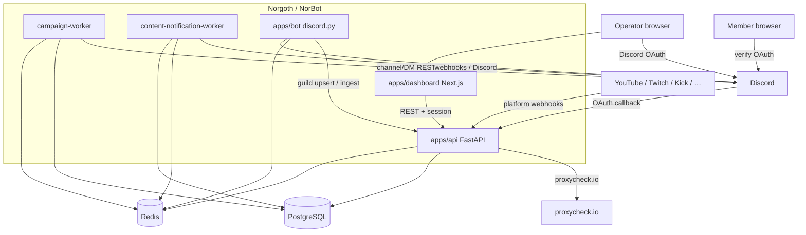

# arc42 Architecture Documentation

**Product:** Norgoth — Discord Community Command Center  
**Deploy / repo name:** NorBot (`norbot.io`)  
**Version:** living document (codebase as of 2026-08-11)  
**Status:** Rebuilt from current codebase (supersedes 2026-08-07 Grand Revision draft where drifted)

---

## Table of Contents

1. [Introduction and Goals](#1-introduction-and-goals)
2. [Architecture Constraints](#2-architecture-constraints)
3. [System Context and External Interfaces](#3-system-context-and-external-interfaces)
4. [Solution Strategy](#4-solution-strategy)
5. [Building Block View](#5-building-block-view)
6. [Runtime View](#6-runtime-view)
7. [Deployment View](#7-deployment-view)
8. [Cross-cutting Concepts](#8-cross-cutting-concepts)
9. [Architecture Decisions](#9-architecture-decisions)
10. [Quality Requirements](#10-quality-requirements)
11. [Risks and Technical Debt](#11-risks-and-technical-debt)
12. [Glossary](#12-glossary)

---

## 1. Introduction and Goals

### 1.1 Product overview

**Norgoth** is a single unified Discord community management stack under `Norgoth/`:

- Live **discord.py** Gateway bot
- **FastAPI** API (verification, feature config, campaigns, content notifications, ingest)
- **Campaign worker** + **content-notification worker**
- **Next.js** operator dashboard

The GitHub/deploy project is branded **NorBot** (Compose project `norbot`, hosts `norbot.io` / `test.norbot.io`). Former sibling `NorgothAuth/` was merged into `Norgoth/apps/api` as the verification domain.

### 1.2 Functional requirements (implemented)

| ID | Requirement | Vertical |
|---|---|---|
| FR-1 | Discord bot connects via Gateway; publishes liveness, guild resources, member snapshots | Bot foundation |
| FR-2 | Welcome / leave messages + auto-role on join, configured in dashboard | Onboarding |
| FR-3 | Member verification: OAuth, policy engine, role grant, HTML result page | Verification |
| FR-4 | Operator dashboard auth via Discord OAuth + guild manage permission | Operator auth |
| FR-5 | Moderation slash commands with audit log + Discord log channel | Moderation |
| FR-6 | Auto-moderation (words, spam, invites, mass mentions) | AutoMod |
| FR-7 | Server event logging (member/message/role/channel) with Postgres logging config | Logging |
| FR-8 | Tickets: panel, private channels, transcripts, share tokens | Community |
| FR-9 | Leveling: XP, ranks, role rewards | Community |
| FR-10 | Auto-responses, role menus, invite tracking | Automation |
| FR-11 | Raid protection + honeypot trap channels | Security |
| FR-12 | Top Trending feed channels (vote ranking windows) | Community |
| FR-13 | Campaigns: channel posts + filtered member DMs via queue + worker | Campaigns |
| FR-14 | Content notifications: multi-platform creator alerts (webhooks + worker) | Notifications |
| FR-15 | Managed embed messages (publish, sync, deletion detection) | Messages |
| FR-16 | Dashboard shows live data only (bot/worker health, queue, configs, logs) | Dashboard |

### 1.3 Quality goals

| Priority | Goal | Motivation |
|---|---|---|
| 1 | Truthful UI | Panels backed by live API; empty states with next action when offline |
| 2 | Durability | Postgres is source of truth for campaigns, tickets, feature configs, XP, etc.; Redis is cache/queue/hot path |
| 3 | Privacy | Member IPs stored only as HMAC-SHA256 hash + AES-256-GCM ciphertext |
| 4 | Operability | Single product `.env`, Compose + GHCR deploys, health/smoke/rollback runbooks |
| 5 | Testability | API/bot pytest + dashboard Vitest/lint/build in CI |

---

## 2. Architecture Constraints

| Constraint | Description |
|---|---|
| Python API + bot | FastAPI / discord.py; **Docker & CI use Python 3.12**; local README may mention newer venvs |
| TypeScript dashboard | Next.js 16 / React 19 |
| PostgreSQL 16 | Durable SoT (verification + feature/runtime tables) |
| Redis 7 (AOF) | Queues, heartbeats, hot configs, resource caches, short-lived tokens/sessions |
| discord.py 2.x | Privileged intents: **Server Members** + **Message Content** |
| Secrets via env | `Norgoth/.env` locally; `/opt/norbot/env/*.env` on VDS — never committed |
| Public ingress | Host nginx TLS only; app ports bound to loopback in prod/test overlays |

---

## 3. System Context and External Interfaces



| System | Protocol | Purpose |
|---|---|---|
| Discord Gateway | WebSocket | Presence, joins, slash commands, message events |
| Discord REST v10 | HTTPS | Roles, messages, channels, embeds, campaign DMs |
| Discord OAuth2 | HTTPS | Member verification + operator dashboard login |
| proxycheck.io | HTTPS | Optional VPN/proxy detection (fail-closed when policy on) |
| Content platforms | HTTPS webhooks / APIs | YouTube WebSub, Twitch EventSub, Kick, etc. |

---

## 4. Solution Strategy

- **One API process** hosts product routes + `/api/v1` verification/session domain.
- **Postgres is the durable source of truth** for verification, feature configs, campaigns, tickets, XP, raid/honeypot, content notifications, embeds, logging config (see `docs/data-durability.md`). Redis remains queue, cache, heartbeats, and hot open-ticket paths.
- **The bot is the source of Discord truth** for channels/roles/members and live events. It publishes snapshots/heartbeats to Redis and ingests durable events via `/internal/ingest/...`.
- **Two workers** share the API image: campaign delivery and content-notification processing.
- **Dashboard** is an authenticated Command Center (`NORGOTH_AUTH_ENFORCED=true` in staging/prod); local may allow anonymous dev session.
- **Module flags** (`/guilds/{id}/modules`) gate each vertical; each module typically has a bot cog, API routes, and a dashboard page.

---

## 5. Building Block View

```
NorBot/
├── .github/workflows/          # ci, deploy-test, deploy-production, rehydrate-test-db
├── docs/arc42.md               # this document
└── Norgoth/                    # product monorepo root
    ├── .env.example
    ├── scripts/                # dev.sh, docker/*, vds/*
    ├── deploy/                 # compose, Dockerfiles, nginx, env examples
    ├── docs/                   # durability, runbooks, checklists
    └── apps/
        ├── api/                # FastAPI + Alembic + workers
        ├── bot/                # discord.py Gateway bot
        └── dashboard/          # Next.js Command Center
```

### 5.1 `apps/api`

| Area | Path / role |
|---|---|
| Entry | `app/main.py` → `create_application()` |
| Product routes | `app/routes/*` — campaigns, bot, modules, automation, automod, tickets, leveling, feeds, raid, honeypot, embeds, content notifications, logging config, ingest, uploads, … |
| Verification + sessions | `app/api/v1/*` under `/api/v1` |
| Workers | `app/workers/campaign_worker.py`, `content_notification_worker.py` |
| Persistence | SQLAlchemy models + Alembic under `app/db/`; Redis via services |
| Security | Session cookies, IP HMAC/AES, OAuth state, guild manage checks |
| Integrations | Discord OAuth/REST, proxycheck, content platforms |

### 5.2 `apps/bot`

| Cog / module | Responsibility |
|---|---|
| `client.py` | Gateway client; guild sync; welcome/leave/autorole |
| `moderation.py` | `/kick` `/ban` `/timeout` `/purge` (+ userinfo) |
| `automod.py` | Words, spam, invites, mass mentions |
| `server_logging.py` | Discord event logging |
| `tickets.py` | Ticket panel, channels, transcripts |
| `leveling.py` | XP, `/rank`, `/leaderboard`, rewards |
| `autoresponder.py` | Keyword replies |
| `roles.py` | Role menus + `/role` |
| `invites.py` | Invite attribution + `/invites` |
| `raid.py` | Join-rate / young-account protection |
| `honeypot.py` | Trap-channel enforcement |
| `feed_channels.py` | Top Trending vote feeds |
| `campaigns.py` | DM unsubscribe UX |
| `embed_sync.py` | Detect deleted published embeds |
| `analytics.py` | Daily engagement collectors |
| `notifications.py` | Retired bridge — delivery owned by API content worker |
| `state.py` | Redis publisher (heartbeat TTL 45s, resources, members, modules) |

Master module keys: `welcome`, `autorole`, `moderation`, `automod`, `logging`, `tickets`, `leveling`, `autoresponder`, `roles`, `invites`, `notifications`, `raid`, `honeypot`, `feed_channels`, `campaigns`.

### 5.3 `apps/dashboard`

Next.js App Router under `src/app/[lang]/` (`en` / `tr`): public landing + login, then authenticated shell (dashboard, campaigns, automation, security, community, messages, audit, settings, observability, servers). Zustand stores; CoreUI + Tailwind; TinyMCE for rich text.

### 5.4 Data responsibilities

| Store | Holds |
|---|---|
| **PostgreSQL** | Guilds/verification, feature configs, campaigns + recipient results, tickets/transcripts, member XP, invite counters, mod/server event logs, raid/honeypot, analytics daily, content-notification graph, embed messages, logging configurations |
| **Redis** | Bot/worker heartbeats & status, guild resources/members, module flags, hot automation/automod/ticket state, campaign queue + schedule zset + activity cache, short-lived sessions/share tokens, spam counters |

Campaign dual-write: Postgres SoT + Redis cache/queue; emergency Redis-only via `NORGOTH_CAMPAIGN_PG_ENABLED=false`.

---

## 6. Runtime View

### 6.1 Operator login

1. Operator hits dashboard login → Discord OAuth (`/api/v1/oauth/discord/dashboard/authorize`).
2. Callback exchanges code; API creates session (`/api/v1/sessions/exchange`).
3. Subsequent API calls use session cookie; guild access gated by Discord manage permission.
4. When `NORGOTH_AUTH_ENFORCED=false` (local), anonymous dev session may be allowed.

### 6.2 Member verification

1. Member opens `/api/v1/oauth/discord/authorize/{guild_id}`.
2. API signs OAuth state → Discord → callback with code.
3. Decision engine: whitelist → blacklist → high-risk guilds → VPN/proxy → shared IP → account age.
4. Allow: bot-token REST grants verified role (removes unverified). Deny: optional unverified role.
5. Attempt logged with hashed/encrypted IP; HTML result page.

### 6.3 Campaign delivery

1. Dashboard creates campaign (channel or DM audience with role filters against bot member snapshot).
2. Launch now → queued; or scheduled via Redis zset until due.
3. Campaign worker pops ID, marks running, substitutes variables, delivers (channel POST or paced DMs).
4. Results dual-written; activity stream updated; failures retry then terminal status.

### 6.4 Member join

1. `on_member_join` → refresh member snapshot.
2. Invite module: diff invite cache → attribute inviter.
3. Welcome module: permission check → template render → send → publish status.
4. Auto-role when enabled; raid/honeypot/logging react as configured.

### 6.5 Content notifications

1. Operators configure creators/templates in dashboard (Postgres).
2. Platforms push webhooks to `/webhooks/...` or worker polls/cursors.
3. Content-notification worker normalizes events and delivers via managed Discord webhooks.

### 6.6 Config change path

Dashboard → API writes Postgres feature config (+ Redis hot mirror where needed) → bot reads module flags / config on event paths (and internal config endpoints where used).

---

## 7. Deployment View

### 7.1 Local development

| Process | Typical command | Port |
|---|---|---|
| Redis | `redis-server` | 6379 |
| PostgreSQL | local PG 14/16, DB `norgoth` | 5432 |
| API | `uvicorn app.main:app --reload` | 8000 |
| Campaign worker | `python -m app.workers.campaign_worker` | — |
| Content worker | `python -m app.workers.content_notification_worker` | — |
| Bot | `python main.py` | — |
| Dashboard | `npm run dev` | 3000 |

Orchestrated by `Norgoth/scripts/dev.sh`. Migrations: `alembic upgrade head` in `apps/api`.

### 7.2 Compose stack (`Norgoth/deploy/`)

Services: `postgres`, `redis`, `api`, `campaign-worker`, `content-worker`, `bot`, `web`.

| Overlay | Project | Loopback ports | Env |
|---|---|---|---|
| `compose.production.yml` | `norbot-prod` | API `:8000`, web `:3000` | `production.env`, auth enforced, campaign PG on |
| `compose.test.yml` | `norbot-test` | API `:8001`, web `:3001` | `test.env`, staging |

Images: GHCR `norbot-api` / `norbot-bot` / `norbot-web`, tagged by git SHA. VDS root: `/opt/norbot/{deploy,env,scripts,releases,backups/postgres}`.

### 7.3 CI/CD (`.github/workflows/`)

| Workflow | Trigger | Behavior |
|---|---|---|
| `ci.yml` | PR + push `main`/`test` | Dashboard lint/test/build; API alembic+pytest (PG16+Redis); bot pytest; Docker build (no push) |
| `deploy-test.yml` | push `test` | Build/push GHCR → SSH migrate + compose test + smoke + record-release |
| `deploy-production.yml` | push `main` | Same + **pre-deploy DB backup** |
| `rehydrate-test-db.yml` | weekly + dispatch | Guarded prod → test DB refresh |

Nginx: `www.norbot.io` → web; `api.norbot.io` → API; test hosts mirror on `:3001`/`:8001`.

---

## 8. Cross-cutting Concepts

- **Configuration:** one product env for API, workers, bot, Alembic. Dashboard: `NEXT_PUBLIC_API_BASE_URL`, `NEXT_PUBLIC_DASHBOARD_URL`. OAuth client trio all-or-none.
- **AuthZ:** operator sessions + `can_manage_guild`; member verification is a separate OAuth flow.
- **IP privacy:** never store raw IPs; HMAC for matching + AES-GCM for authorized recovery.
- **Fail-closed:** proxycheck errors deny when VPN policy is enabled.
- **Internal ingest:** bot → API durable event writes (`/internal/ingest/{guild_id}/...`).
- **Uploads:** `/uploads` static mount; image upload validation; S3-ready `storage_provider` on embed media.
- **i18n:** `en` / `tr` via `[lang]` segment.
- **Observability:** health endpoints, request-context logging, Compose json-file log rotation, smoke/rollback runbooks.

---

## 9. Architecture Decisions

| # | Decision | Status |
|---|---|---|
| ADR-1 | Unified Norgoth stack (former two-product split merged) | Active |
| ADR-2 | discord.py Gateway bot in `apps/bot` (Python aligned with API) | Active |
| ADR-3 | Bot Discord state shared via Redis (no bot-hosted HTTP API) | Active |
| ADR-4 | Campaigns support channel posts **and** member DMs via worker | Active (supersedes older channel-only ADR text) |
| ADR-5 | Verification role grants via API bot-token REST (no Gateway on request path) | Active |
| ADR-6 | Hot paths in Redis; durable configs/runtime in Postgres (SoT migration) | Active |
| ADR-7 | Content notifications owned by API worker + platform webhooks (bot cog retired bridge) | Active |
| ADR-8 | Dashboard operator auth via Discord OAuth; enforced in staging/prod | Active |
| ADR-9 | Nginx sole public ingress; Compose services on internal network | Active |

---

## 10. Quality Requirements

| Scenario | Expectation |
|---|---|
| Bot offline | Dashboard empty states explain bot required + setup steps |
| Worker crash | Worker health offline within ~45s (heartbeat TTL) |
| Discord send fails | Campaign ends with failure activity naming Discord error |
| proxycheck outage | Verification denies (fail-closed) when VPN policy on |
| Deploy to prod | DB backup before migrate; smoke check after |
| Rollback | Image rollback ≠ schema rollback; expand/contract migrations preferred |
| CI | Dashboard lint/test/build + API/bot pytest + image builds green |

---

## 11. Risks and Technical Debt

| Risk / debt | Notes |
|---|---|
| Dual-write complexity | Campaigns/tickets/configs span Postgres + Redis; drift possible if ingest fails |
| Redis ring buffers | Hot mod/event logs capped (e.g. 500 / 1000); durable copies depend on ingest |
| Multi-guild UX maturity | Servers page exists; confirm switcher/coverage vs single-guild habits |
| Python version drift | README may cite 3.14 locally while Docker/CI pin 3.12 |
| Content platform surface | Many optional credentials; partial config yields degraded monitoring |
| Schema rollback | `rollback-app.sh` does not alembic downgrade — forward-fix migrations required |
| Legacy Redis notification routes | Older `/notifications` paths coexist with content-notifications domain |

---

## 12. Glossary

| Term | Definition |
|---|---|
| Guild | A Discord server |
| Snowflake | Discord 64-bit ID (encodes creation timestamp) |
| Intent | Gateway event-category opt-in (e.g. members, message content) |
| Module | Feature vertical with master on/off flag per guild |
| Verified role | Role granted after successful member verification |
| Auto-role | Role granted automatically on member join |
| Campaign | Scheduled or immediate channel/DM delivery job |
| Decision engine | Ordered verification policy evaluation (allow/deny + reason) |
| SoT | Source of truth — Postgres for durable product data |
| Ingest | Internal API path for bot → durable event persistence |
| NorBot | Deploy/product brand and Compose project name for Norgoth |

---

## Document history

| Date | Change |
|---|---|
| 2026-08-07 | Grand Revision 0.2.0 draft |
| 2026-08-11 | Full rewrite from codebase: auth, Postgres SoT, workers, modules, VDS/CI deploy |
