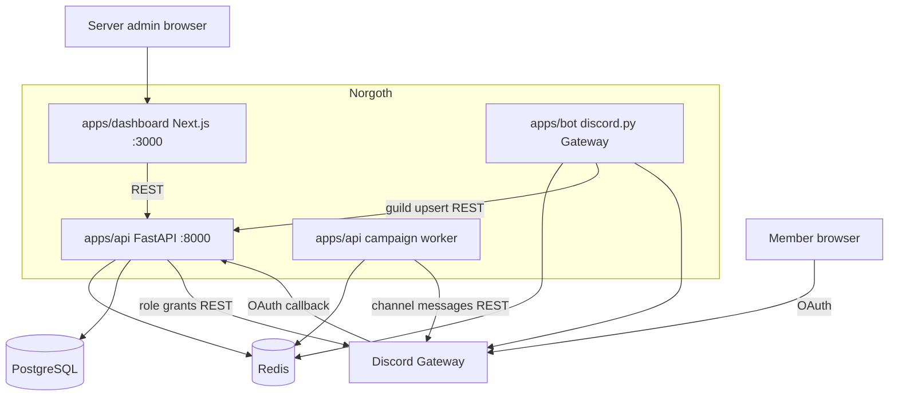

# arc42 Architecture Documentation

**Product:** Norgoth — Discord Community Command Center
**Version:** 0.2.0 (Grand Revision)
**Date:** 2026-08-07
**Status:** Living document based on current codebase

---

## Table of Contents

1. [Introduction and Goals](#1-introduction-and-goals)
2. [Architecture Constraints](#2-architecture-constraints)
3. [System Context and External Interfaces](#3-system-context-and-external-interfaces)
4. [Solution Strategy](#4-solution-strategy)
5. [Building Block View](#5-building-block-view)
6. [Runtime View](#6-runtime-view)
7. [Deployment View](#7-deployment-view)
8. [Cross-cutting Concepts](#8-cross-cutting-concepts)
9. [Architecture Decisions](#9-architecture-decisions)
10. [Quality Requirements](#10-quality-requirements)
11. [Risks and Technical Debt](#11-risks-and-technical-debt)
12. [Glossary](#12-glossary)

---

## 1. Introduction and Goals

### 1.1 Product overview

Norgoth is a **single unified product** under `Norgoth/`: a Discord community
management stack with a live bot, member verification, moderation, campaign
delivery, and onboarding automation, operated from a web dashboard.

The former sibling project `NorgothAuth/` has been **merged** into
`Norgoth/apps/api` as the verification domain (see `NorgothAuth/MIGRATED.md`;
the old repository is kept for git history only).

### 1.2 Functional requirements (implemented)

| ID | Requirement | Vertical |
|---|---|---|
| FR-1 | Discord bot connects via Gateway, publishes liveness/guild data | Bot foundation |
| FR-2 | Welcome message + auto-role on member join, configured in dashboard | Onboarding |
| FR-3 | Member verification: OAuth flow, policy engine, role grant, HTML result page | Verification |
| FR-4 | Moderation slash commands: /kick /ban /timeout /purge /userinfo with audit log + Discord log channel | Moderation |
| FR-5 | Campaigns deliver real messages to a chosen Discord channel via queue + worker with retries | Campaigns |
| FR-6 | Dashboard shows only live data: bot health, queue state, worker heartbeat, verification logs, moderation logs | Dashboard |

### 1.3 Quality goals

| Priority | Goal | Motivation |
|---|---|---|
| 1 | Truthful UI | Every dashboard panel is backed by a live API; mock KPI theater was removed |
| 2 | Testability | Verification domain has 246 unit tests; each vertical has a manual test gate |
| 3 | Privacy | Member IPs stored only as HMAC-SHA256 hash + AES-256-GCM ciphertext |
| 4 | Operability | Single `.env`, one dev script, health endpoints for bot/worker/queue |

---

## 2. Architecture Constraints

| Constraint | Description |
|---|---|
| Python 3.14 + FastAPI | API, worker, and bot are Python; dashboard is TypeScript/Next.js |
| PostgreSQL | Verification domain persistence (guilds, configurations, logs, lists) |
| Redis | Campaign queue/schedule, bot/worker heartbeats, guild resources cache, automation config, moderation log |
| discord.py 2.x | Gateway bot with `guilds` + `members` intents |
| Secrets via `.env` | `Norgoth/.env` (never committed); template in `Norgoth/.env.example` |

---

## 3. System Context and External Interfaces



External interfaces:

| System | Protocol | Purpose |
|---|---|---|
| Discord Gateway | WebSocket | Bot presence, member join events, slash commands |
| Discord REST v10 | HTTPS | Role grants (verification), channel messages (campaigns, welcome, mod log) |
| Discord OAuth2 | HTTPS | Member identity + guild list during verification |
| proxycheck.io | HTTPS | Optional VPN/proxy detection (fail-closed) |

---

## 4. Solution Strategy

- **One API process** (`apps/api`) hosts two domains:
  - *Redis-backed product routes* (no auth DB needed): `/campaigns`, `/bot/health`,
    `/guilds/{id}/discord-resources`, `/guilds/{id}/automation`,
    `/guilds/{id}/moderation-logs`.
  - *Postgres-backed verification domain* under `/api/v1`: guilds, configuration,
    user lists, blacklisted guilds, verification logs, OAuth.
- **The bot is the source of Discord truth.** It publishes guild channels/roles and
  its own status into Redis; the API serves that to the dashboard. The bot also
  upserts guilds into the verification domain on `on_guild_available`.
- **The worker delivers campaigns.** It pops campaign IDs from a Redis queue and
  posts to the configured channel via Discord REST with bounded retries; message
  IDs and errors land in the activity stream.
- **The dashboard renders only wired data** and offers empty states with the next
  action when the bot is offline or nothing is configured.

---

## 5. Building Block View

```
Norgoth/
├── .env.example            # single product env template
├── scripts/dev.sh          # start Redis, Postgres, API, worker, bot, dashboard
├── apps/
│   ├── api/
│   │   ├── app/
│   │   │   ├── main.py             # unified FastAPI app
│   │   │   ├── routes/             # campaigns, bot, automation, moderation, modules,
│   │   │   │                       # automod, server_logs, tickets, leveling,
│   │   │   │                       # autoresponder, role_menus, invites, notifications (Redis)
│   │   │   ├── api/v1/             # verification routers (Postgres)
│   │   │   ├── core/               # settings, logging, exceptions
│   │   │   ├── db/                 # SQLAlchemy base/session + Alembic migrations
│   │   │   ├── models/             # guild, configuration, verification log, lists
│   │   │   ├── repositories/       # data access for verification domain
│   │   │   ├── services/           # decision engine, verification, campaign_store
│   │   │   ├── security/           # IP protection (HMAC/AES), OAuth state
│   │   │   ├── integrations/       # discord oauth, discord bot REST, proxycheck
│   │   │   ├── workers/campaign_worker.py  # real Discord delivery
│   │   │   └── tests/              # 246 tests
│   │   └── scripts/seed_verification.py
│   ├── bot/
│   │   ├── main.py                 # entrypoint
│   │   └── bot/
│   │       ├── client.py           # NorgothBot: sync, heartbeats, welcome/leave
│   │       ├── moderation.py       # /kick /ban /timeout /purge + audit logging
│   │       ├── automod.py          # words, spam, invite links, mass mentions
│   │       ├── server_logging.py   # member/message/role/channel event logging
│   │       ├── tickets.py          # ticket panel, private channels, transcripts
│   │       ├── leveling.py         # XP, /rank, /leaderboard, role rewards
│   │       ├── autoresponder.py    # keyword-triggered replies
│   │       ├── roles.py            # role-menu buttons + /role add|remove
│   │       ├── invites.py          # invite cache, join attribution, /invites
│   │       ├── notifications.py    # YouTube RSS + Twitch Helix poller
│   │       ├── state.py            # Redis publisher/reader + module flags
│   │       └── config.py           # env settings
│   └── dashboard/
│       └── src/
│           ├── app/[lang]/         # home, campaigns, onboarding, audit, automation, settings
│           ├── components/         # live panels only (campaigns, verification, moderation, automation)
│           └── lib/api.ts          # API_BASE_URL (NEXT_PUBLIC_API_BASE_URL)
└── docs/
```

### Redis key map

| Key | Writer | Reader | Purpose |
|---|---|---|---|
| `norgoth:bot:heartbeat` (TTL 45s) | bot | API | Bot liveness |
| `norgoth:bot:status` | bot | API | Identity, latency, intents, guilds |
| `norgoth:guild:{id}:resources` | bot | API | Channels/categories/roles for dashboard pickers |
| `norgoth:guild:{id}:members` | bot | API/worker | Member snapshot (id, roles, bot flag) for DM targeting |
| `norgoth:guild:{id}:modules` | API | bot | Master on/off flags per module |
| `norgoth:guild:{id}:automation` | API | bot | Welcome/leave/auto-role/mod-log config |
| `norgoth:guild:{id}:welcome:status` | bot | API | Last welcome delivery attempt + reason |
| `norgoth:guild:{id}:modlog` | bot | API | Moderation audit entries (capped 500) |
| `norgoth:guild:{id}:automod` | API | bot | Auto-moderation rules and exemptions |
| `norgoth:guild:{id}:automod:*` (TTL) | bot | bot | Spam sliding-window counters |
| `norgoth:guild:{id}:logging` | API | bot | Server logging config (channels + toggles) |
| `norgoth:guild:{id}:eventlog` | bot | API | Server event ring buffer (capped 1000) |
| `norgoth:guild:{id}:tickets:*` | API/bot | API/bot | Ticket config, records, counter, transcripts |
| `norgoth:guild:{id}:leveling:config` | API | bot | Announce mode + role rewards |
| `norgoth:guild:{id}:xp` (zset) | bot | API/bot | XP leaderboard |
| `norgoth:guild:{id}:xp:cooldown:{uid}` (TTL 60s) | bot | bot | XP award cooldown |
| `norgoth:guild:{id}:autoresponses` | API | bot | Auto-response rules (max 50) |
| `norgoth:guild:{id}:rolemenus` | API | API | Role menu definitions |
| `norgoth:guild:{id}:invites:*` | bot | API/bot | Join attribution, inviter counters, recent joins |
| `norgoth:guild:{id}:notifications` | API | bot | Watched creators (YouTube/Twitch) |
| `norgoth:guild:{id}:notifications:seen` | bot | bot | Last-seen video IDs / live state (dedupe) |
| `norgoth:campaigns`, `norgoth:campaign:{id}` | API/worker | API/worker | Campaign documents incl. per-recipient DM results |
| `norgoth:campaign_execution_queue` | API | worker | FIFO execution queue |
| `norgoth:campaign_scheduled` | API | worker | Scheduled launches (zset) |
| `norgoth:campaign_activity` | API/worker | API | Activity stream |
| `norgoth:worker:heartbeat` (TTL 45s) | worker | API | Worker liveness |

---

## 6. Runtime View

### 6.1 Member verification (end to end)

1. Member opens `/api/v1/oauth/discord/authorize/{guild_id}` (link shown in dashboard).
2. API signs an OAuth state and redirects to Discord.
3. Discord redirects to `/api/v1/oauth/discord/callback` with code + state.
4. API exchanges the code, loads user + guild list, computes account age.
5. Decision engine evaluates whitelist → blacklist → blacklisted guilds → VPN/proxy → shared IP → account age.
6. On allow: bot-token REST grants the verified role (and removes the unverified role). On deny: optionally assigns the unverified role.
7. Attempt is logged (hashed/encrypted IP); member sees an HTML success/denied page.

### 6.2 Campaign delivery

1. Wizard creates a campaign targeting either a channel (`discord_channel_id`) or member DMs (role include/exclude filters resolved against the bot's member snapshot).
2. Launch now → `queued` + pushed to the execution queue; scheduled → zset until due.
3. Worker pops the ID, marks `running`, substitutes variables (`{user_name}`, `{server_name}`, `{campaign_name}`), and delivers: one POST for channel campaigns, or one DM per recipient (~1/sec) with per-recipient sent/failed/attempts tracking stored on the campaign.
4. Success: `completed` with counts and message IDs in activity. Failure: bounded retries, then `completed_with_failures` or `failed`.

### 6.3 Member join / leave

1. Discord fires `on_member_join`; the bot refreshes the member snapshot.
2. If the `invites` module is enabled, the invite cache is diffed to attribute the inviter (vanity URL and unknown handled) and counters are updated.
3. If the `welcome` module is enabled, the bot pre-checks channel permissions, renders the welcome template (`{user}`, `{username}`, `{server}`, `{member_count}`, `{inviter}`, `{inviter_count}`), sends it, and publishes the delivery status to Redis for the dashboard. Auto-role is applied when its module is enabled.
4. On `on_member_remove`: leave message (if configured), inviter leave-counter decrement, and a server-log event.

### 6.4 Moderation

1. Moderator runs `/kick`, `/ban`, `/timeout`, `/purge`, or `/userinfo` (guild-scoped commands, Discord permission-gated).
2. Bot executes the action, appends an entry to the Redis mod log, and posts an embed to the configured log channel.
3. Dashboard **Audit Logs** page lists entries via `/guilds/{id}/moderation-logs`.

---

## 7. Deployment View

Local development (single machine):

| Process | Command | Port |
|---|---|---|
| Redis | `redis-server` (daemonized) | 6379 |
| PostgreSQL | `brew services start postgresql@14`, database `norgoth` | 5432 |
| API | `apps/api: .venv/bin/uvicorn app.main:app --reload` | 8000 |
| Worker | `apps/api: .venv/bin/python -m app.workers.campaign_worker` | — |
| Bot | `apps/bot: .venv/bin/python main.py` | — |
| Dashboard | `apps/dashboard: npm run dev` | 3000 |

Or all at once: `Norgoth/scripts/dev.sh`. Migrations: `apps/api: .venv/bin/python -m alembic upgrade head`.

---

## 8. Cross-cutting Concepts

- **Configuration:** one `Norgoth/.env` loaded by API, worker, bot, and Alembic.
  Discord OAuth vars (`NORGOTH_DISCORD_CLIENT_ID/SECRET/REDIRECT_URI`) must be set
  all-or-none. The dashboard uses `NEXT_PUBLIC_API_BASE_URL`.
- **IP privacy:** raw IPs never persisted; HMAC-SHA256 keyed hash for shared-IP
  matching + AES-256-GCM ciphertext for authorized recovery.
- **Fail-closed security:** proxycheck errors deny verification when VPN policy is on.
- **Error surfaces:** verification domain uses structured error responses;
  campaign failures surface as activity entries; dashboard panels show inline errors
  with retry buttons.
- **i18n:** `en` and `tr` locales via the `[lang]` route segment.

---

## 9. Architecture Decisions

| # | Decision | Status |
|---|---|---|
| ADR-1 | ~~Two sibling products~~ → **superseded**: unified into one Norgoth stack (Grand Revision, 2026-08) | Superseded |
| ADR-2 | discord.py Gateway bot in `apps/bot`; Python matches the API | Active |
| ADR-3 | Bot state shared via Redis instead of bot-hosted HTTP server | Active |
| ADR-4 | Campaigns = one message to one channel (not per-member DMs); audience simulation removed with email/SMS platforms | Active |
| ADR-5 | Verification role grants executed by API via bot-token REST (no gateway dependency in request path) | Active |
| ADR-6 | Automation/moderation config in Redis JSON; verification config in Postgres | Active |

---

## 10. Quality Requirements

| Scenario | Expectation |
|---|---|
| Bot offline | Dashboard panels show explicit "bot required" empty states with setup steps |
| Discord send fails | Campaign completes with failure activity naming the Discord error |
| proxycheck outage | Verification denies (fail-closed) with 502 to the member |
| Worker crash | `/campaigns/worker/health` reports offline within 45 s (heartbeat TTL) |
| API tests | `apps/api: pytest` — 246 tests green |

---

## 11. Risks and Technical Debt

- **No dashboard authentication** — anyone reaching :3000/:8000 can operate the
  system. Acceptable locally; must be added before any deployment.
- **Single-guild UX** — dashboard auto-selects the bot's first guild; a guild
  switcher is needed for multi-guild operation.
- **Campaign store is schemaless Redis JSON** — fine for current scope; consider
  Postgres if campaign history must be durable.
- **Moderation log capped at 500 entries** per guild in Redis.
- **`audience_count` is still an estimate** in the wizard UI; delivery is per
  channel, so the number is informational only.

---

## 12. Glossary

| Term | Definition |
|---|---|
| Guild | A Discord server |
| Snowflake | Discord's 64-bit ID (encodes creation timestamp) |
| Intent | Gateway event-category opt-in (e.g. `members`) |
| Verified role | Role granted after successful verification |
| Auto-role | Role granted automatically on member join |
| Campaign | A scheduled or immediate message delivered by the worker to a channel |
| Decision engine | Ordered policy evaluation producing allow/deny + reason |
